# JMeter

Es un proyecto de Apache que nos permite llevar a cabo pruebas sobre servicios web, para hacer uso de esta herramienta, dirigete al sitio oficial [Presionando aquí](https://jmeter.apache.org/) y dirigiendote a **Descargas**, en este apartado selecciona el archivo zip de la sección *Binaries*.

Descomprime la carpeta, dirigete a *bin* y ejecuta el archivo de aplicación o en su defecto el que dice `JMeter.bash`. Realizado el paso anterior la herramienta se iniciará y podremos usarla.
# Primeros pasos
Click derecho en `Plan de Pruebas` y presionar en: Añadir --> Hilos(Usuarios) --> Grupos de Hilos.
El grupo de hilos se encargará de almacenar todas las peticiones e información que viaje entre el JMeter y el navegador

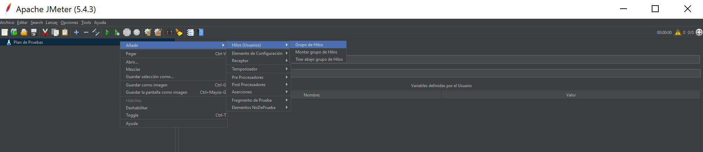

Asignar un nombre al hilo

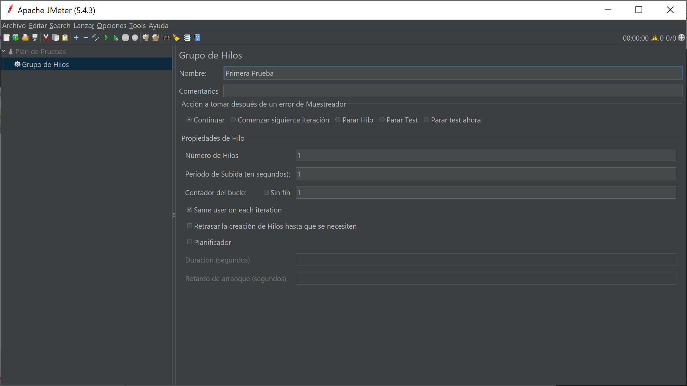

Ahora, asignar un elemento proxy http de pruebas:

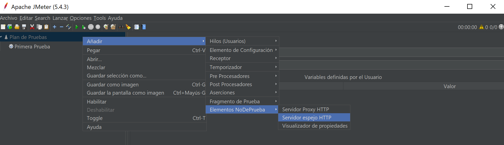

En este servidor proxy debemos tener en cuenta que sea el mimso puerto que el que usaremos con el navegador, en este caso trae un puerto por defecto, pero es necesario verificar.

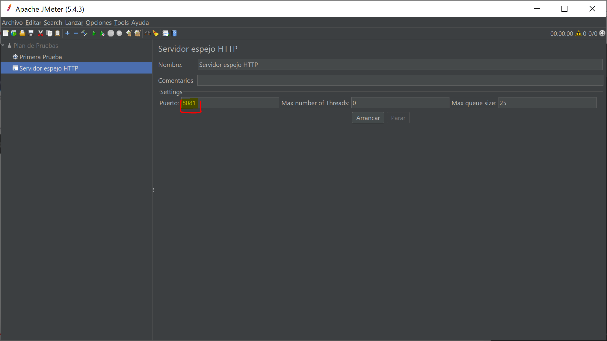

Para comprobar el puerto de nuestro navegador podemos dirigirnos a: Tools --> Buscar Proxy --> Seleccionar la opción manual y configurar el puerto. (Muy importante especificar **localhost** y el puerto necesario. Debe ser localhost porque lo hacemos desde nuestro equipo local).

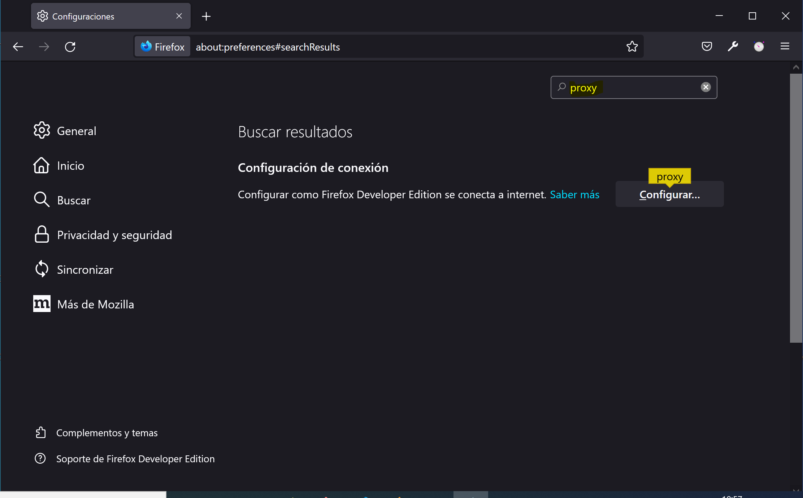

Y configuramos el mismo puerto que el JMeter:

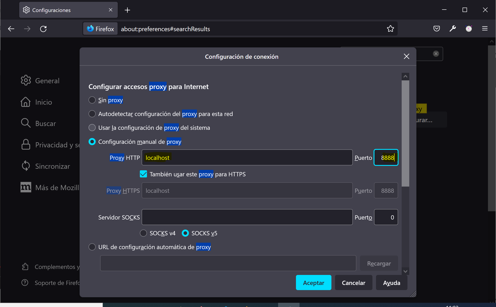

Una vez configurado el puerto, seleccionamos el grupo de hilos y podemos dar en arrancar, lo que hará el JMeter es comenzar a grabar las acciones para poder hacer las pruebas.

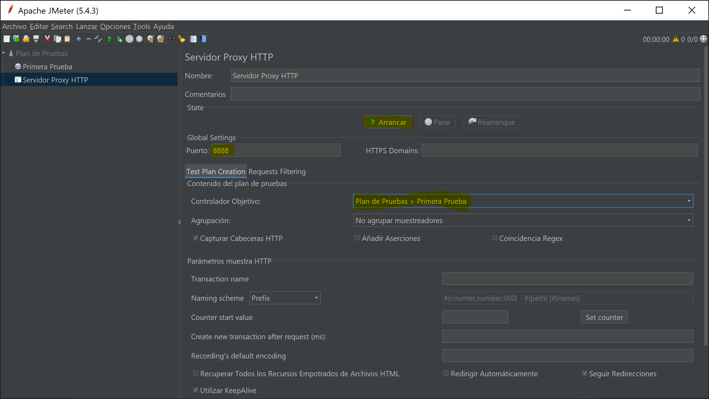

Nos dirá que aceptemos un certificado, lo aceptamos y automaticamente sale una ventana `pop up` que más adelante explicaremos.

Tras dar en arrancar podemos ir a [esta página de pruebas de Apache](www.blazedemo.com) para poder seguir con nuestra práctica. Esto nos dirigirá al homepage, si vamos al JMeter podemos ver como es que comienza a grabar la primera petición:

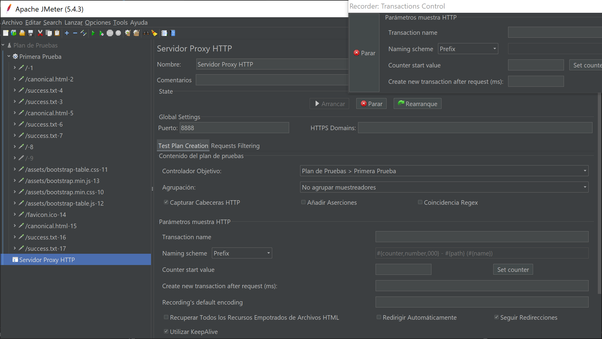

Ahora seguiremos haciendo acciones, por ejemplo simular el llenado:

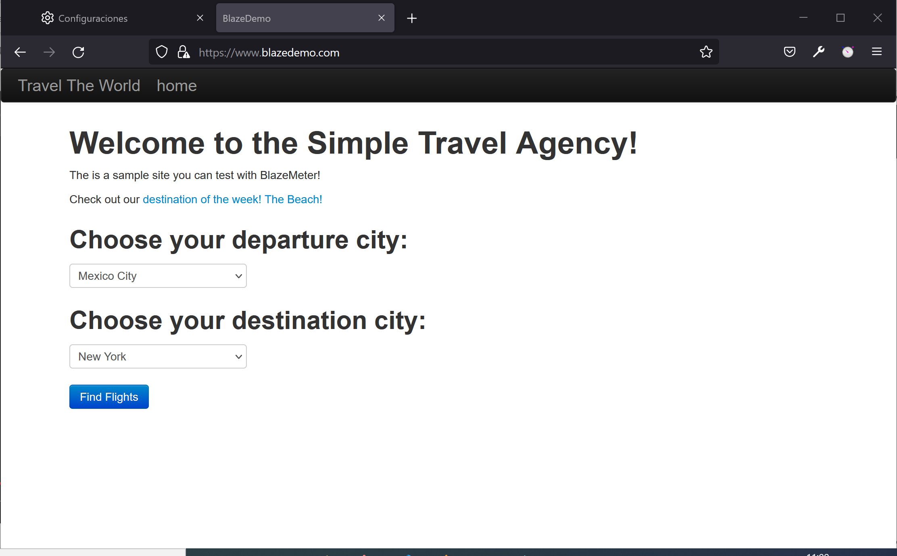

Seleccionamos un destino:

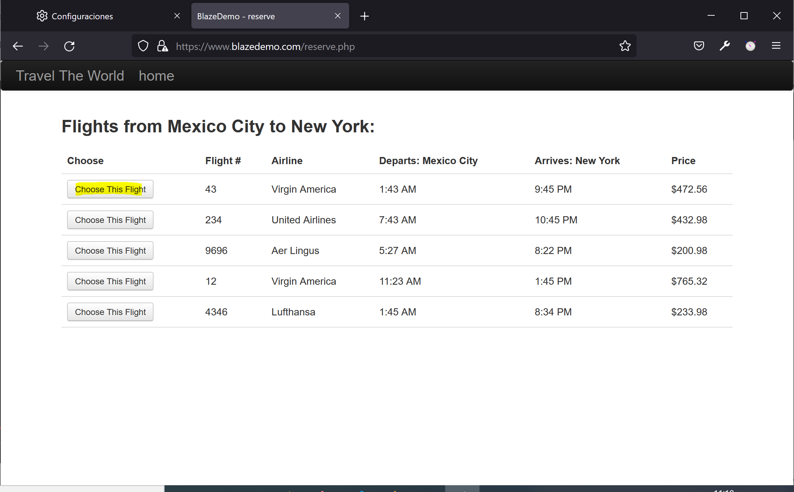

Llenamos el formulario con toda la información y damos en aceptar:

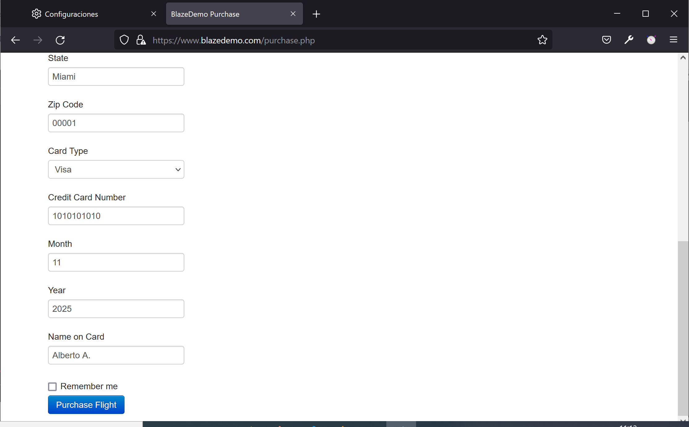

Al final recibiremos el siguiente apartado con información de lo que llenamos:

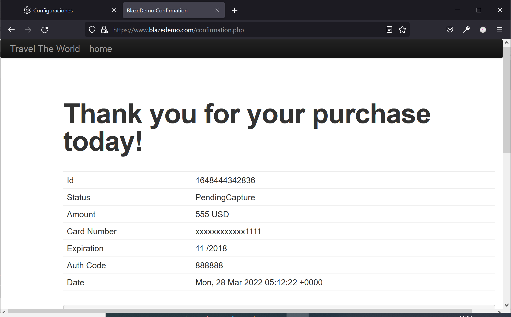

Si vamos al JMeter, veremos que se registran los request con cierta información:

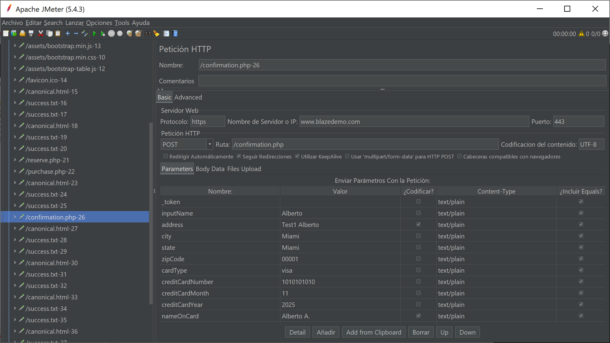

Para parar la grabación podemos dar click en `parar` de la ventanita que salió.

## Segunda prueba

Ahora crearemos un nuevo grupo de hilos, y asignaremos el proxy a ese grupo, ahora en este caso usaremos el **pop up**, en el podemos poner el nombre de la acción y seguido de ello presionar en el navegador, esto hará que el JMeter asocie el nombre con la acción.

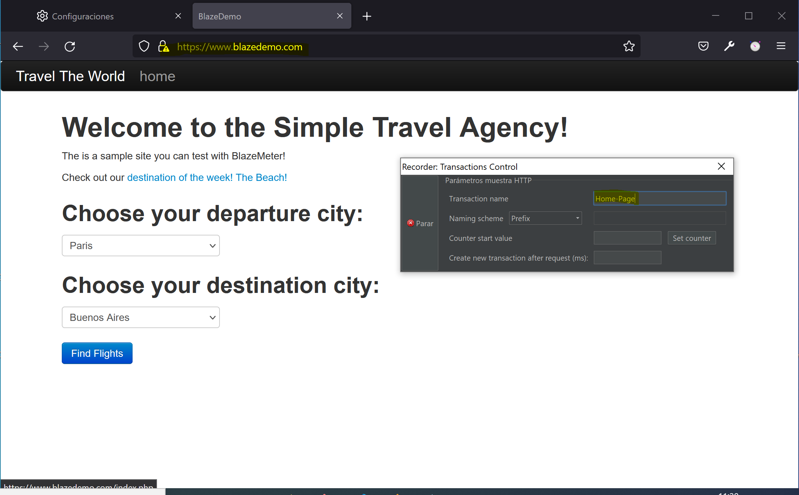

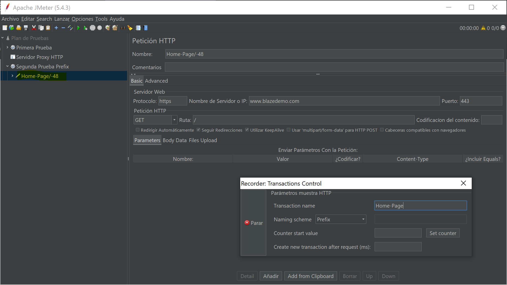

Seguimos llenando las acciones y veremos que los datos se llenan correctamente, de esta forma podemos ver que acción esta asociada con que parte del sistema:

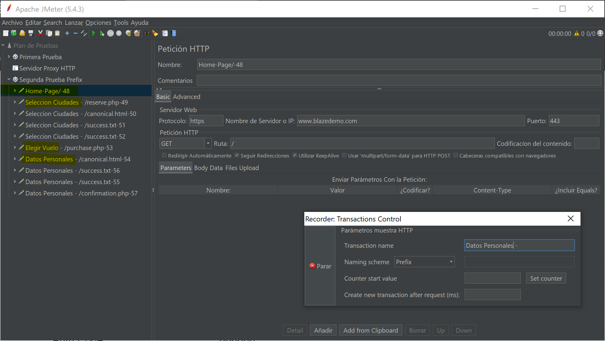

[Curso referencia](https://www.youtube.com/watch?v=E2zwM8s7thY)